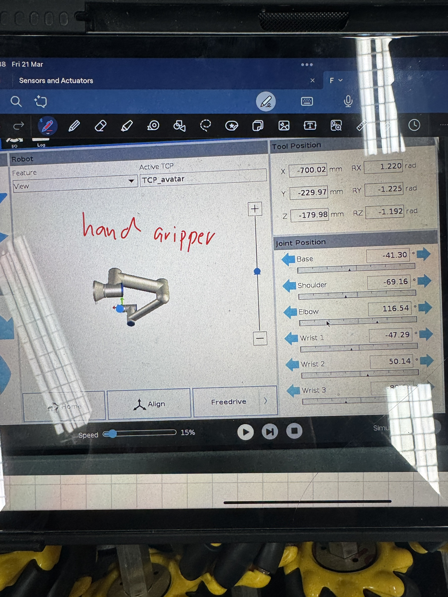
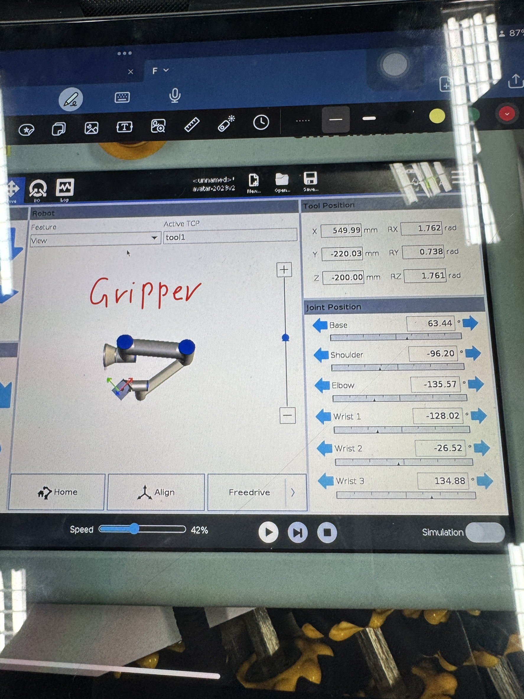

# FRA631_Project_Dual_arm_UR5
## UR5 Information

| Arm       | IP Address       |
|-----------|------------------|
| Left Arm  | 192.168.200.10   |
| Right Arm | 192.168.200.20   |

## Home Position
<p align="center">
    
    
</p>

Base from image information:
### Tool Position and Orientation

Left Arm:
| Parameter | Value    | Unit |
|-----------|---------|------|
| X         | -700.02 | mm   |
| Y         | 229.21  | mm   |
| Z         | -179.98 | mm   |
| Rx        | 1.220   | rad  |
| Ry        | -1.225   | rad  |
| Rz        | -1.192   | rad  |

Right Arm:
| Parameter | Value    | Unit |
|-----------|---------|------|
| X         | 500.99 | mm   |
| Y         | -220.03  | mm   |
| Z         | -200.00 | mm   |
| Rx        | 1.762   | rad  |
| Ry        | 0.738   | rad  |
| Rz        | 1.761   | rad  |

### Joint Positions

Left Arm:
| Joint    | Value    | Unit |
|----------|---------|------|
| Base     | -41.30   | °    |
| Shoulder | -69.16   | °    |
| Elbow    | -116.54  | °    |
| Wrist 1  | -47.29    | °    |
| Wrist 2  | 50.14     | °    |
| Wrist 3  | -89.54     | °    |

Right Arm:
| Joint    | Value    | Unit |
|----------|---------|------|
| Base     | 63.44   | °    |
| Shoulder | -96.20   | °    |
| Elbow    | -135.57  | °    |
| Wrist 1  | -128.02    | °    |
| Wrist 2  | -26.52     | °    |
| Wrist 3  | 137.88    | °    |

---

step 1 crate venv and activate it
```bash
set-executionpolicy -Scope CurrentUser -ExecutionPolicy Unrestricted
python -m venv venv
venv/Scripts/Activate.ps1
```
> [!WARNING]
> Make sure to activate the venv before installing the requirements
> ```bash
> venv/Scripts/Activate.ps1
> ```
> it shoud be like this
> 

step 2 install requirements
```bash
pip3 install -r .\requirements.txt
```
