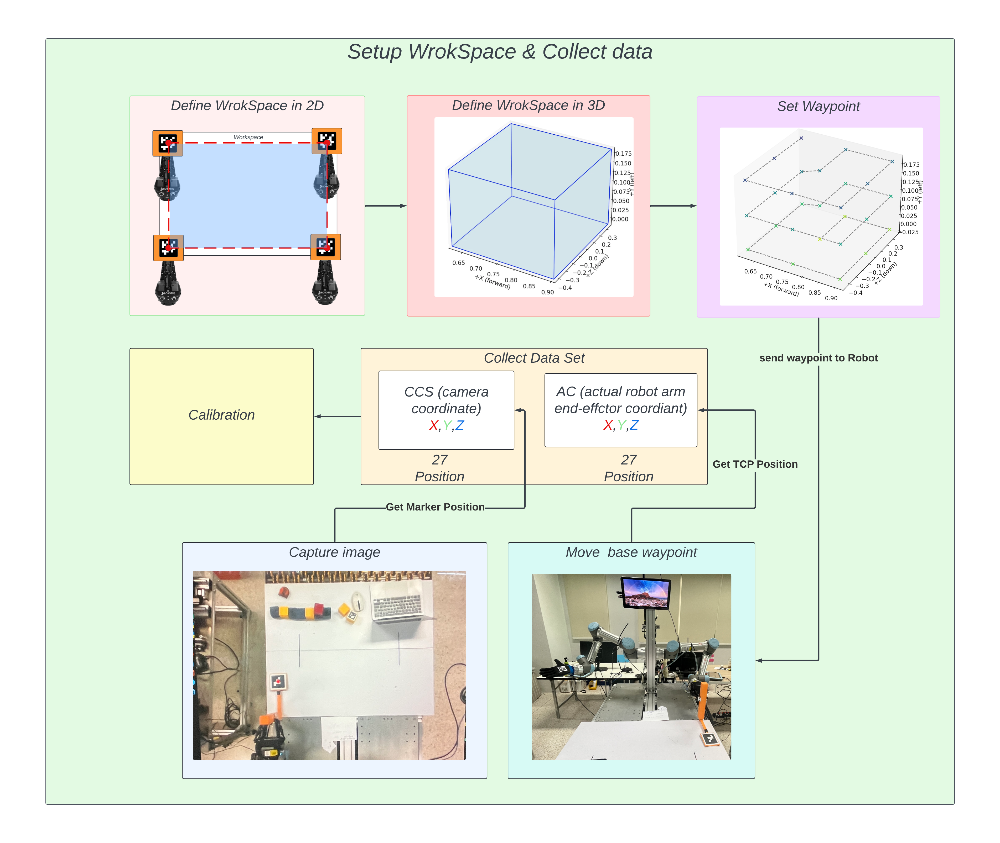
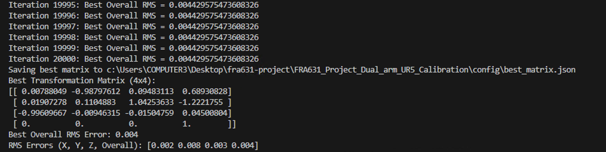

# FRA631 Dual Arm UR5 Calibration

Repository for calibration between a camera and the UR5e robot arm.

## Table of Contents

- [Overview](#overview)
- [Installation](#installation)
  - [Step 1: Clone the Repository](#step-1-clone-the-repository)
  - [Step 2: Setup Virtual Environment](#step-2-setup-virtual-environment)
  - [Step 3: Install Dependencies](#step-3-install-dependencies)
- [Calibration Concept](#calibration-concept)
  - [How It Works](#how-it-works)
  - [Why Use an Affine Matrix?](#why-use-an-affine-matrix)
  - [Calibration Steps](#calibration-steps)
    - [Workspace Setup and Data Collection](#workspace-setup-and-data-collection)
    - [Calibration with Affine Matrix](#calibration-with-affine-matrix)
  - [Custom Calibration Tool](#custom-calibration-tool)
  - [Adjusting TCP Position](#adjusting-tcp-position)
- [Running Calibration](#running-calibration)
  - [Configuration (`main.py`)](#configuration-mainpy)
  - [Data Collection](#data-collection)
  - [Calculating Affine Matrix](#calculating-affine-matrix)
- [Calibration Results](#calibration-results)
- [Conclusion](#conclusion)

## Overview


## Installation

> [!Note]
> This project's Python package is only supported on Python 3.11.XX and not beyond this version.
> To be sure, you can check the version of Python by running the following command in your terminal:
> ```bash
> python --version
> ```

### Step 1: Clone the Repository

```bash
git clone https://github.com/peeradonmoke2002/FRA631_Project_Dual_arm_UR5_Calibration.git
```

### Step 2: Setup Virtual Environment

**Linux/MacOS:**

```bash
python3 -m venv calibration_venv
source calibration_venv/bin/activate
```

**Windows:**

```powershell
set-executionpolicy -Scope CurrentUser -ExecutionPolicy Unrestricted
python -m venv calibration_venv
calibration_venv\Scripts\Activate.ps1
```

### Step 3: Install Dependencies

**For Developers:**

```bash
pip install -r dev-requirements.txt
```

**For Robot Installation:**

```bash
pip install -r robot-requirements.txt
```

## Calibration Concept

### How It Works

The robot follows instructions based on camera observations. Calibration aligns the robot and camera coordinates through an affine matrix transformation.


### Why Use an Affine Matrix?

Affine matrices accommodate translation, rotation, and scaling, crucial for accurately aligning 3D camera and robot arm coordinates.

[Learn More About Affine Matrices](https://towardsdatascience.com/understanding-transformations-in-computer-vision-b001f49a9e61)

### Calibration Steps

#### Workspace Setup and Data Collection



**Steps:**

- **Define 2D Workspace**: Place ArUco markers at four corners.
- **Extend to 3D Workspace**: Create a 3D space by stacking multiple planes.
- **Waypoint Selection**: Define 27 waypoints.
- **Data Collection**: Robot and camera record positions at each waypoint.

Data from the robot's TCP and camera markers is saved for calibration.

#### Calibration with Affine Matrix


- Calculate the affine matrix using collected data points.
- Iterate to minimize RMS error, improving the accuracy of the transformation.


### Custom Calibration Tool

A specially designed tool is used to position the marker safely and accurately.


**Advantages:**

- Prevents robot collisions.
- Ensures stable and clear marker visibility.
- Improves calibration accuracy.


### Adjusting TCP Position

TCP (Tool Center Point) position is adjusted to account for the marker offset (18 cm in X and Y).


## Running Calibration

### Configuration (`main.py`)

Set workspace reference points and parameters:

```python
BL_ref = [0.6158402179629584, 0.18426921633782534, 0.3510680386492011]
TL_ref = [0.9034970156209872, 0.18431919874933683, 0.3510680386492011]
TR_ref = [0.9035034184486379, 0.18425659123476879, -0.43708867396716417]
BR_ref = [0.6158402179629584, 0.18424774957164802, -0.43708867396716417]

vertical_distance = 0.10  # 10 cm between planes
num_planes = 3
```

### Data Collection

Execute the data collection process:

```bash
python3 main.py
```

- Robot moves through waypoints.
- Data saved to `calibration_data.csv`.


### Calculating Affine Matrix

Run the calibration script:

```bash
python3 caribration-affine_matrix.py
```

- Calculates the best affine transformation matrix.
- Results saved in `best_matrix.json`.

## Calibration Results



After 20,000 iterations:

- **Best RMS Error**: 0.004
- **Axis Errors**:
  - X: 0.002
  - Y: 0.008
  - Z: 0.003

The matrix was saved to a file for later use. With this matrix, the robot can now accurately move based on the object position from the camera’s view.
