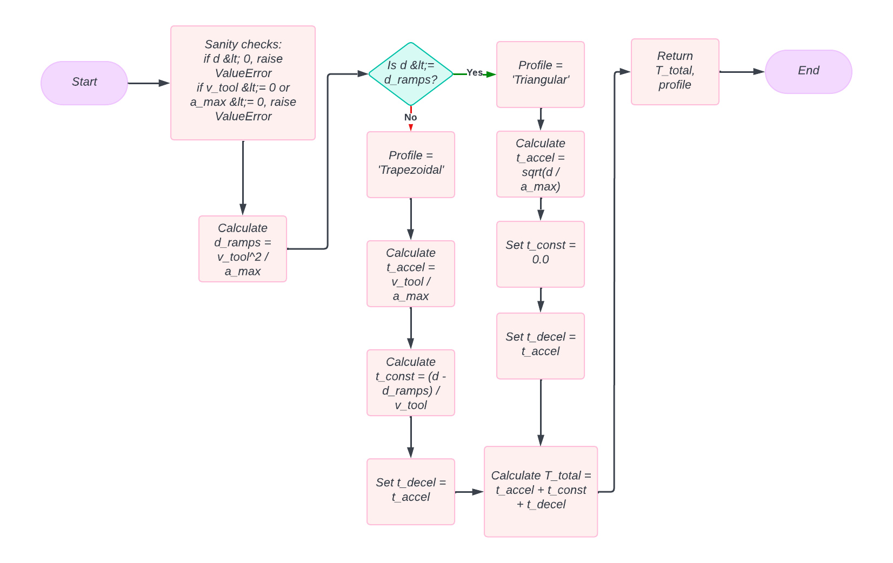

# FRA631_Project Arm UR5e Trajectory_Planning

Repository for trajectory planning of UR5e robots.

---

## Table of Contents
- [Overview](#overview-diagram)
- [Installation](#installation)
- [System Flow](#system-flow)
- [Trajectory Concept](#trajectory-concept)
- [Trajectory Generation in Task Space](#trajectory-generation-in-task-space)
  - [Time Calculation for Trajectory Planning](#time-calculation-for-trajectory-planning)
  - [Triangular Velocity Profile](#triangular-velocity-profile)
- [From TCP Waypoints to Joint Trajectory](#from-tcp-waypoints-to-joint-trajectory)
- [Speed Control Concept](#speed-control-concept)
  - [Speed Control Flow](#speed-control-flow)
- [Step-by-Step Planning Process](#step-by-step-planning-process)
- [Planning Results](#planning-results)
- [Conclusion](#conclusion)
- [References](#references)

---

## Overview Diagram

### Trajectory Planning Diagram


### Speed Control Diagram


---

## Installation

> [!Note]
> This project's Python package is only supported on Python 3.11.XX and not beyond this version.
> To be sure, you can check the version of Python by running the following command in your terminal:
> ```bash
> python --version
> ```

### Step 1: Clone the Repository

```bash
git clone https://github.com/peeradonmoke2002/FRA631_Project_Dual_arm_UR5_Trajectory_Planning.git
```

### Step 2: Setup Virtual Environment

**Linux/MacOS:**

```bash
python3 -m venv trajectory_venv
source trajectory_venv/bin/activate
```

**Windows:**

```powershell
set-executionpolicy -Scope CurrentUser -ExecutionPolicy Unrestricted
python -m venv trajectory_venv
trajectory_venv\Scripts\Activate.ps1
```

### Step 3: Install Dependencies

**For Developers:**

```bash
pip install -r dev-requirements.txt
```

**For Robot Installation:**

```bash
pip install -r robot-requirements.txt
```

---

## System Flow

This project focuses on moving two UR5e robot arms smoothly and synchronously through four main stages:

- **Task Planning**: Define the robot's objective.
- **Path Planning**: Use camera input to determine movement direction. [More Info](https://github.com/peeradonmoke2002/FRA631_Project_Dual_arm_UR5_Calibration)
- **Trajectory Planning** *(Main Focus)*: Generate smooth waypoint-based motion paths.
- **Speed Control** *(Main Focus)*: Execute motion commands using low-level control like `speedJ` for safety and smoothness.

---

## Trajectory Concept

There are two primary spaces for motion planning:


### Task Space
- Plan motion in 3D space.
- Requires solving IK at each time step.
- High precision and obstacle-aware.

### Joint Space
- Solve IK only at waypoints.
- Interpolate motion directly between joint positions.
- Faster but less control over path.

|  | **Task Space** | **Joint Space** |
|---|---|---|
| **Advantages** | Predictable 3D motion<br>Obstacle avoidance | Faster execution<br>Smoother joint interpolation |
| **Disadvantages** | Computationally intensive<br>Unnatural joint behavior | Potentially unsafe motion paths |

**Chosen Approach**: **Task Space**
- Needed for high precision and obstacle awareness.
- Consistent with marker-based object detection.

---

## Trajectory Generation in Task Space

We use **Cubic Polynomial (3rd Order)** trajectory planning to ensure smooth motion:

```math
q(t) = a_3 t^3 + a_2 t^2 + a_1 t + a_0
```

- Allows defining both start and end positions and velocities.
- Coefficients `a_0` to `a_3` are computed based on boundary conditions.

### Flowchart


Before applying the cubic function, we calculate the total movement time:



### Time Calculation for Trajectory Planning

To calculate the total movement time using a trapezoidal velocity profile, we divide the motion into three phases:

1. **Acceleration Phase**:
```math
t_a = \frac{V_{max}}{a}
```
```math
d_a = \frac{1}{2} a t_a^2
```

2. **Deceleration Phase**:
```math
t_d = \frac{V_{max}}{a}
```
```math
d_d = \frac{1}{2} a t_d^2
```

3. **Constant Velocity Phase**:
```math
d_c = D - (d_a + d_d)
```
```math
t_c = \frac{d_c}{V_{max}}
```

**Total Time**:
```math
T = t_a + t_c + t_d
```

### Triangular Velocity Profile

If the total distance `D` is too short for the robot to reach `V_{max}`, the robot follows a **triangular velocity profile**. In this case:

- There is **no constant velocity phase**.
- The robot accelerates to a **peak velocity** `V_p` (less than `V_{max}`) and then immediately decelerates.
- The time to accelerate and decelerate is equal.

Let `t_p` be the time to reach `V_p`, and `a` be the acceleration:

```math
D = a t_p^2 \Rightarrow t_p = \sqrt{\frac{D}{a}}
```

```math
V_p = a t_p = \sqrt{a D}
```

**Total Time**:
```math
T = 2 t_p = 2 \sqrt{\frac{D}{a}}
```

These calculations are derived from the velocity-time diagram and uniformly accelerated motion equations.

Then, we generate trajectories for each axis:


---

## From TCP Waypoints to Joint Trajectory

After generating task-space waypoints, we use **Inverse Kinematics** to convert them to joint space:


- IK is solved at each TCP waypoint.
- Valid joint angles are added to the trajectory list.
- Failure in IK halts the motion plan for safety.

---

## Speed Control Concept

Real-time motion is achieved using the **Jacobian matrix**:


```math
\dot{X} = J(\theta) \dot{\theta}
```
```math
\dot{\theta} = J^{-1}(\theta) \dot{X}
```

This enables us to convert desired end-effector speeds to joint speeds.

### Speed Control Flow


1. Generate trajectory using cubic polynomial.
2. Define desired linear velocity (angular = 0).
3. Use current joint state to compute Jacobian.
4. Invert Jacobian to get `\dot{\theta}`.
5. Send joint velocities using `speedJ`.
6. Repeat until full trajectory is executed.

---

## Step-by-Step Planning Process

> *This is a test planning step. The main project flow integrates Task Planning.*

1. Place ArUco marker boxes in the workspace:


2. Run the grasping script:
```bash
python move2object.py
```

3. The robot will:
- Move to the marker-defined box
- Grasp the box
- Return to home position
- Place the box back

The robot follows the **marker index order** to perform these actions.

---

## Planning Results

**Video coming soon**

---

## Conclusion

This project demonstrates a dual-arm UR5 trajectory planning system with smooth motion in task space. By leveraging:
- **Cubic Polynomial Planning**
- **Jacobian-Based Speed Control**

we achieved synchronized, precise, and safe robot movements.

---

## References
- [MATLAB Trajectory Planning](https://www.youtube.com/watch?v=Fd7wjZDoh7g)
- [How to calculate velocity (Linearmotiontips)](https://www.linearmotiontips.com/how-to-calculate-velocity/)

